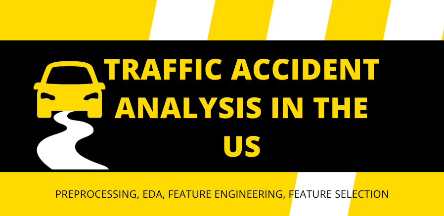

  

[***Click here to download detailed Report***](https://github.com/manuethomas/traffic-demo/blob/main/Report/Analysis%20of%20Traffic%20Accidents%20in%20the%20US.pdf)

## Problem Statement

The primary goal of the project was to analyze traffic accident data in the US from 2016 to 2023 using the ”US Accident (2016-2023)” dataset and find out relevant features that can be used to build a predictive system in the future.

- Analyse the primary causes of accidents and their associated risk levels
- Identify key factors that most reliably indicate the occurance of a major accident
- Find out relevant features that could help forecast both the probability and severity of accidents before they happen.
- Share the insights with stakeholders about where accidents commonly happen, patterns in casualties, and how weather and environmental conditions influence accident occurrence.

## Approach

- Dataset Overview
- Import relevant libraries
- Load the dataset
- Data Preprocessing 
    - Removing Unnecessary Features
    - Transforming Datetime Feature
    - Handling Missing Values
    - Outlier Treatment
- Exploratory Data Analysis & Feature Engineering
    - Resampling
    - Time-Based Feature Analysis
    - Location-Based Feature Analysis
    - Weather Feature Analysis
    - Point of Interest Features Analysis
- Feature Selection
- Further Analysis
- Key Insights and Recommendations

## Exploratory Data Analysis & Feature Engineering

### Time-Based Feature Analysis

- When do most severe accidents occur during the year? 
- How does accident frequency vary between weekdays and weekends?
- What time of day sees the most accidents?
- Are night accidents different from day accidents? 

### Location-Based Feature Analysis

- Which states have the highest accident counts?s
- Which states have the most severe accidents?
- Does public transit usage in a county affect accident rates?
- Which types of roads are most dangerous?
- Are accidents concentrated in specific cities?
- Which timezone sees the most accidents?

### Weather Feature Analysis

- Which weather conditions are most dangerous for driving?
- What role do visibility, pressure, and wind speed play?

### Point of Interest (POI) Feature Analysis

- How do traffic signals and crossing impact accident severity?
- Are there any specific infrastructural impact on accident severity?

## Key Takeaways

- Summer months + weekends + nighttime = Highest risk for severe accidents
- Georgia & Florida lead in severe accidents despite CA/TX/FL having most total accidents
- Less public transit = More severe accidents in a county
- Traffic signals & crossings cut accident severity significantly
- Interstate highways are hotspots for severe accidents
- Accidents spread across cities rather than concentrated in specific areas
- Night accidents are fewer but deadlier
- Rain/snow conditions notably increase accident severity

## References

- Moosavi, Sobhan, Mohammad Hossein Samavatian, Srinivasan Parthasarathy, Radu Teodorescu, and Rajiv Ramnath. “Accident Risk Prediction based on Heterogeneous Sparse Data: New Dataset and Insights.”

- Triveni Sangama Saraswathi Edla. "Exploratory Data Analysis (EDA) of US Accidents and Prediction of Accident Severity in San Fransisco bay area"

- Medium: Ronghui Zhou, Ph.D.""How You Can Avoid Car Accident in 2020"